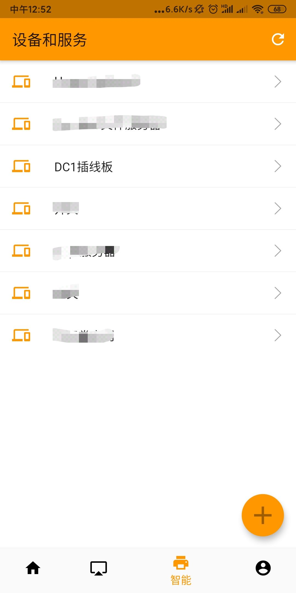
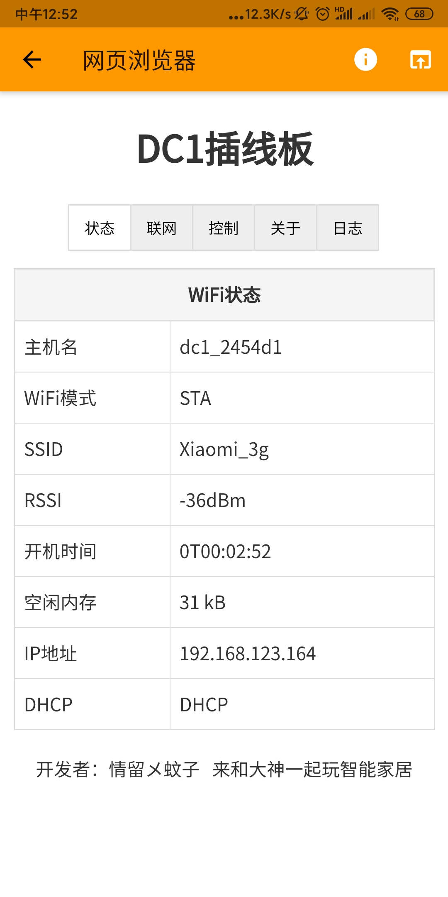
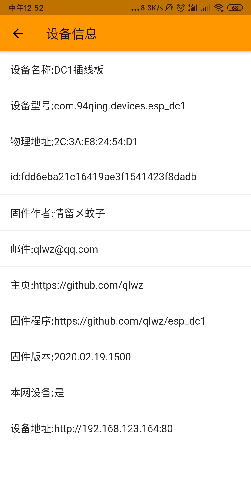

本文档介绍对于[OpenIoTHub](https://github.com/OpenIoTHub/OpenIoTHub)app的支持.

## app操作界面 
* 目前初步是以webUI方式打开，从[v1.2.7](https://github.com/OpenIoTHub/OpenIoTHub/releases/tag/v1.2.7)开始支持，以后通过app升级方式提供native操作界面

## 使用方法
- app下载：https://github.com/OpenIoTHub/OpenIoTHub/releases v1.2.7+
- app打开“智能”选项卡(如图1)即可搜索到之前已经配网成功的插排
- app远程控制可以使用OpenIoTHub[网关](https://github.com/OpenIoTHub/gateway-go) (通过网关可以支持本固件插排的远程使用)