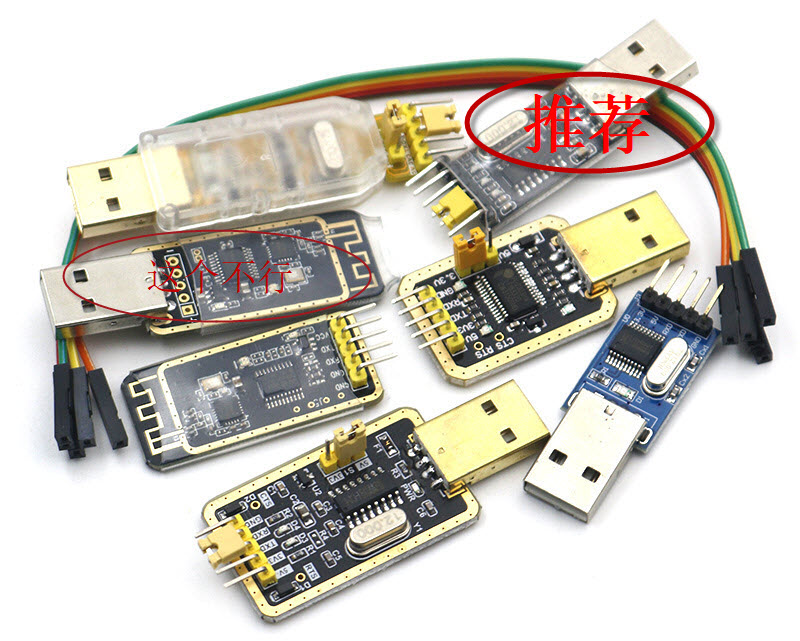
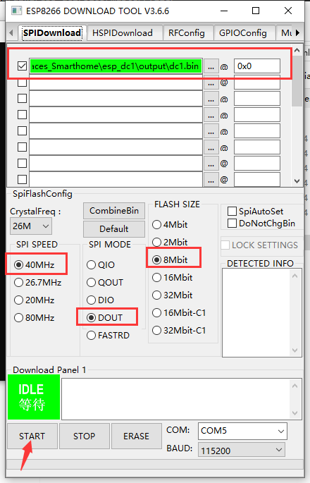

固件烧录需要拆解DC1,通过ttl模块与pc相连,运行烧录软件进行刷机.

## 目录

[拆机与TTL接线方法](#拆机与TTL接线方法)

​	[1、拆主控板](#1、拆主控板)

​	[2、主控板接线](#2、主控板接线)

[软件刷机](#软件刷机)

​	[工具/固件下载](#工具/固件下载)

​	[开始烧录](#开始烧录)

## 拆机与TTL接线方法

> 本章节(拆机与TTL接线方法)中所有内容(包含图片)均来自[三木大神的基于esphome的DC1插座自制固件](https://github.com/Samuel-0-0/phicomm_dc1-esphome/tree/master/cookbook),感谢授权使用

   请勿带市电操作！！！危险自负！！！

#### 1、拆主控板

##### 用到的工具

##### 拆板步骤

**如果插座刚通过电，拆的时候千万不要去摸电路板，电容带电！！！**

#### 2、主控板接线

##### 用到的TTL工具

任选一个即可

##### 接线方法

## 软件刷机

### 工具/固件下载

确认硬件连接正常后,下载以下软件:

烧录软件: flash_download_tools_vX.zip	[点这里下载](https://www.espressif.com/zh-hans/support/download/other-tools)

完整固件: dc1.bin	[点这里下载](https://github.com/qlwz/esp_dc1/releases)

### 开始烧录

将flash_download_tools_vX.zip解压,打开目录下的flash_download_tools_vX.exe,选择ESP8266 DownloadTool,根据以下截图做配置,

将与主控板连接的usbTTL连接上电脑(确保主控io0必需短接gnd后再上电,以进入刷机模式),根据自己的实际串口号设置.,点击START按钮即可开始烧录.

稍等片刻,出现即为烧录超过

注意:部分发现烧录完成后可能出现问题无法使用.可以尝试用以上烧录软件ERASE擦除一次后重新烧录.

进入烧录模式后点ERASE,显示完成即为擦除超过.再将主控板重新上电并再次进入刷机模式,重新点START烧录即可

## 从ESPhome升级到ESP DC1固件

有人测试直接从esphomeota到dc1固件成功,本人未做测试,需要的可以试试看.可以将结果反馈给我,谢谢

在esphome中ota选择dc1.bin固件升级即可